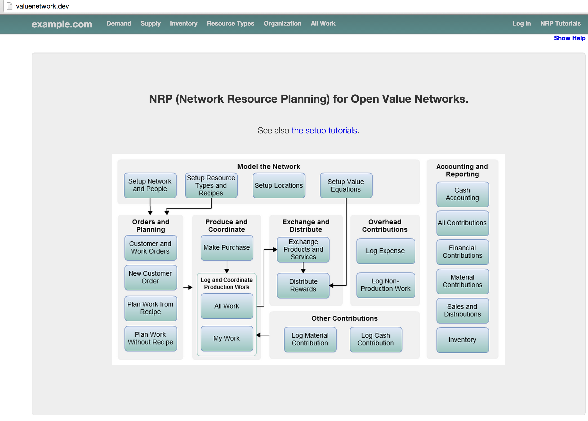

# Installation

## Install Docker

Follow instructions from [Docker documentation](https://docs.docker.com/installation/).

## Install Vagrant

If you're a `OS X` or `Windows` user, you might want to use [vagrant](https://www.vagrantup.com/) to run a `Linux` box 
from where to run `Docker`.

In order to do so, the `Vagrantfile` of the project root directory can be relied upon.

`Vagrant` can be installed by following instructions from [Vagrant documentation](https://www.vagrantup.com/downloads.html)

Run a virtual machine (ubuntu 14.04)

```
vagrant up
```

Access the virtual machine via ssh

```
vagrant ssh
```

Install a http proxy to access the Docker container from outside the vagrant box

Within the box

```
sudo apt-get install apache2
sudo a2enmod proxy_http
cd /vagrant
sudo cp docs/configuration/etc/apache2/sites-available/valuenetwork.conf /etc/apache2/sites-available
sudo a2ensite valuenetwork.conf
sudo service apache2 reload
```

From the host machine, figure the ip address of the guest machine before adding a new entry to your host file.

```
VAGRANT_LOG=ERROR vagrant ssh -c 'ip address | grep eth0 | grep inet'
```

```
VAGRANT_HOST=192.168.1.44
sudo /bin/bash -c 'echo "'$VAGRANT_HOST'    valuenetwork.dev" >> /etc/hosts'
```

Change directory before jumping to the next steps

```
cd /vagrant
```

## Build the application image

Prepare the user creation script to be executing when building the application image
by exporting your own environment variables values for user, password and email.

```
export EMAIL='admin@example.com'
export PASSWORD='mrY7rZZ6ztjN90fN6hy6'
export USER='valuenetwork_user'

sed "s/VALUE_NETWORK_EMAIL/$EMAIL/" cmd/create-user.sh.dist > cmd/create-user.sh
sed -i "s/VALUE_NETWORK_PASSWORD/$PASSWORD/" cmd/create-user.sh
sed -i "s/VALUE_NETWORK_USER/$USER/" cmd/create-user.sh
```

```
# Build image as super-user
sudo docker build -t valuenetwork .
```

Please note than python dependencies are installed twice using separate `RUN` command 
and `requirements.txt` in order to leverage cache layers.

## Run the application container

```
cd /vagrant
sudo docker run --net=host -v `pwd`:/var/www/valuenetwork -d valuenetwork
```

## Access pages served by the web server

When running the container from within a virtual machine using vagrant,
the virtual network interface `eth0` of the box is relied upon to run a web server listening to port 8000.

```
# Option "--net" allows us to leverage the box virtual network interface
--net=host
```

At image build time, the command which can be found in `cmd/run-server.sh` 
would have been copied to `/var/www/valuenetwork` (path available from within the docker container).

As a result, the web server running from within the docker container, from within a virtual machine, 
listens to requests on port 8000 of the guest loopback address.

The apache2 proxy exposes the server from the host machine.

At this step, you should be able to access `http://valuenetwork.dev` in a browser installed on your host:


